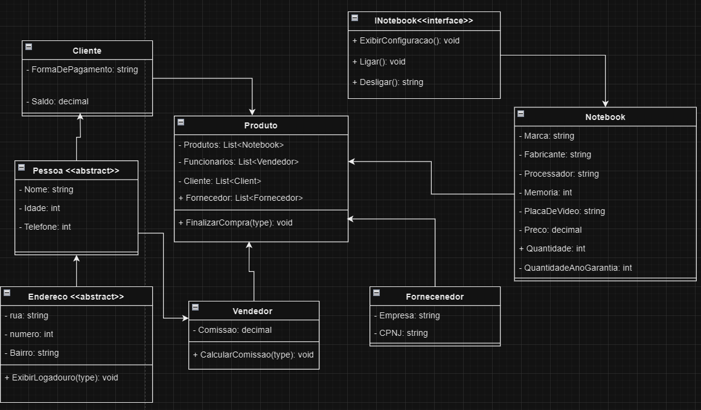

# Projeto de Venda de Notebook

Este projeto é uma abstração de um sistema de venda de notebooks, implementado em C#.

## Serialização com Newtonsoft.Json

O projeto utiliza a biblioteca `Newtonsoft.Json` para serializar os dados da venda do notebook. A serialização é um processo de transformar os dados do objeto em um formato que pode ser armazenado ou transmitido e, em seguida, reconstruído posteriormente.

Aqui está um exemplo de como a serialização é realizada neste projeto:

## Como usar

Para usar este projeto, você pode clonar o repositório e abrir o projeto no Visual Studio. Certifique-se de ter a biblioteca Newtonsoft.Json instalada.

## Contribuições

Contribuições são bem-vindas! Por favor, leia as diretrizes de contribuição antes de enviar uma solicitação pull.

